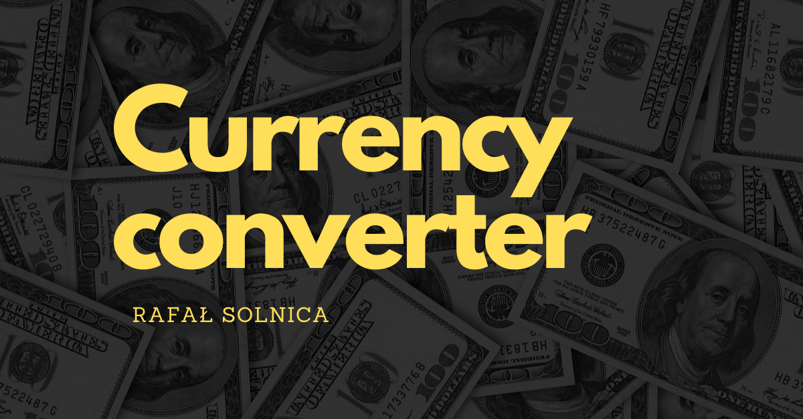

# Rafał Solnica - Currency converter

Welcome to my simple currency converter that I've made as a homework during YouCode front-end course.

## For the first time I used in this project:

- JavaScript functions
- simple form validation
- icon designed by me with the help of Canva website: https://www.canva.com/

## Demo

## https://rafalsolnica.github.io/currency-converter/

## How does it work?

In the first field choose starting currency, in second enter the amount, and then in the third select currency you want to convert into. Next click "Przelicz" button and result should show under the form. In case of not stating any amount of currency the field will highlight itself signaling error. Currency exchange rates originate from Google finance on March 16, 2023.

## In makeing of this project I used:

- HTML, BEM convention, Normalize.css, JavaScript, CSS
- minimalistic graphic style
- simplicity of use
